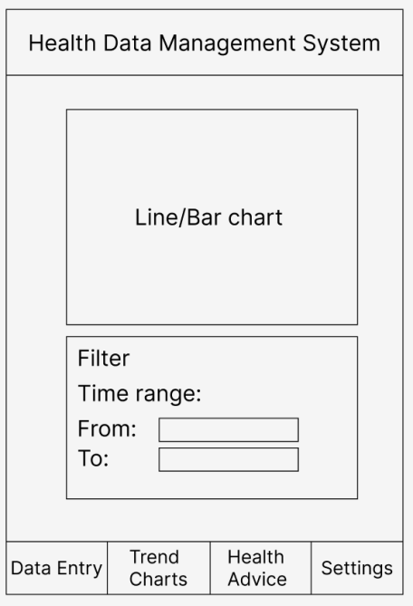
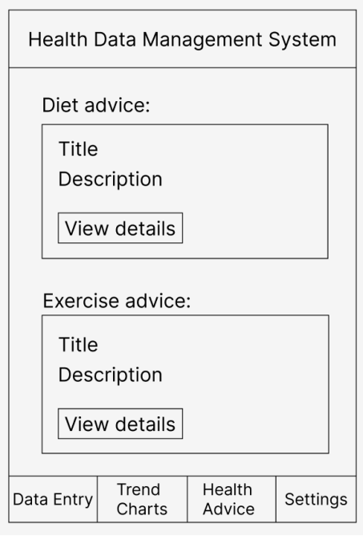
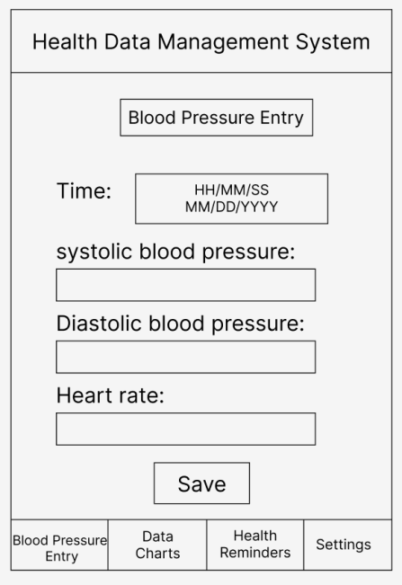
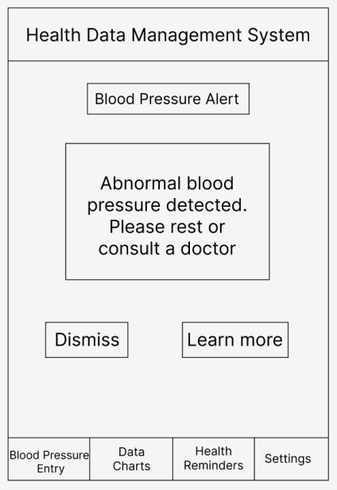
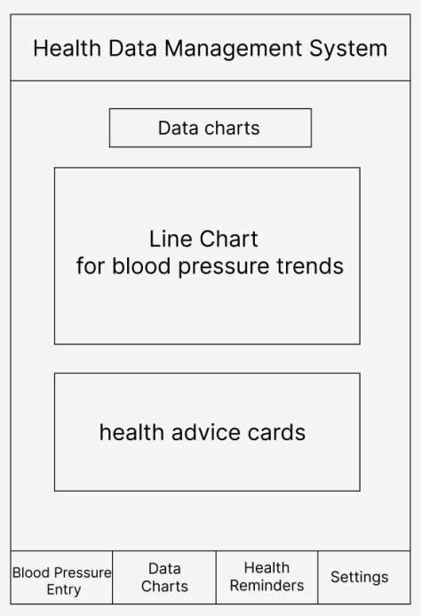
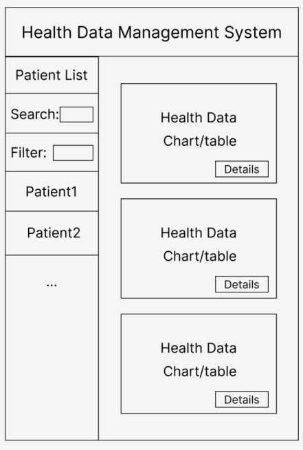
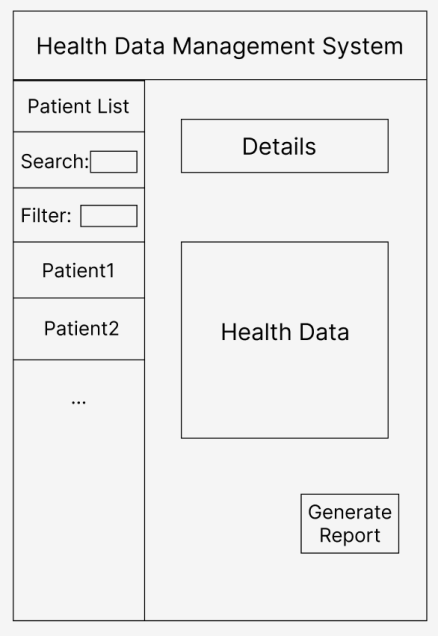
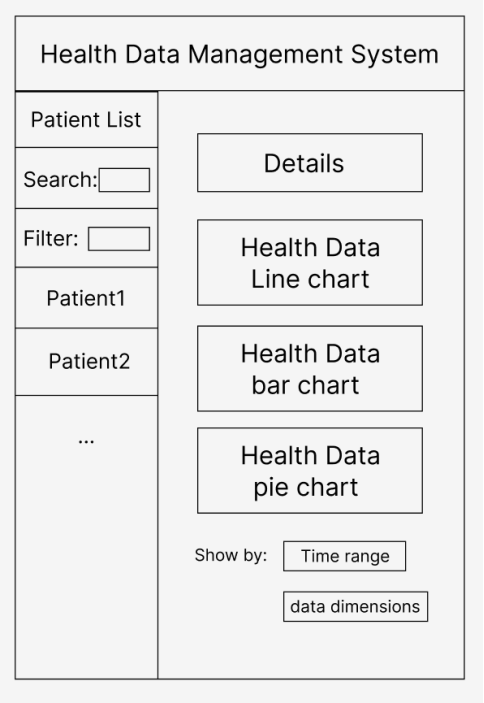

# Project 1 - Health Data Management System

## 1. Project Introduction

The system is designed to help users record, analyze and manage health data, display health trends through charts, and provide personalized health advice based on user data. The system is suitable for fitness enthusiasts, patients with chronic diseases (such as high blood pressure) and medical personnel. Users can input data such as weight, blood pressure, heart rate, exercise, sleep, etc., set daily health reminders, and import data from smart devices or export reports for doctors' reference.

## 2. **Business Requirements**

### Goal

To help users fully understand their health status and adjust their lifestyle in time according to data feedback to prevent or improve health problems.

### Key Features

* **Health Data Recording:** Users can input data such as weight, blood pressure, heart rate, exercise, and sleep.
* **Data Visualization:** Use charts and trend graphs to help users visually understand the changes in their health status.
* **Health Reminders:** Provide daily reminders (e.g., to drink water, take medication, or exercise) to improve the efficiency of health management.
* **Personalized Health Advice:** Based on data analysis, offer tailored advice on diet, exercise, and lifestyle adjustments.
* **Data Import/Export:** Support importing data from smart devices and exporting health reports for reference by doctors.

## 3. Nouns-Verbs

### Nouns:

* User
* Health Data
* Health problems
* Health status
* Feedback
* Weight
* Blood pressure
* Heart rate
* Exercise
* Sleep
* Charts
* Graphs
* Reminders
* Health management
* Health advice
* Diet
* Lifestyle adjustments
* Health report
* Doctors
* Data analysis
* Reference
* Smart device

### Verbs:

* Record
* Input
* Understand
* Provide
* Improve
* Offer
* Support
* Import
* Export
* Manage
* Prevent
* Adjust

## 4. Target Audience

* **Fitness Enthusiasts:**
  Those who pay attention to sports data, calorie consumption, and training effects, and pursue body management and health improvement.
* **Chronic Disease Patients (e.g., High Blood Pressure Patients):**
  Individuals who need to monitor indicators such as blood pressure regularly and hope to receive abnormal reminders and personalized suggestions.
* **Healthcare Professionals (Doctors):**
  Professionals who hope to obtain patient health data reports to formulate treatment plans more comprehensively.

## 5. Rules

* **Data privacy and security:** All user data must be encrypted and stored in compliance with relevant laws and regulations.
* **Data accuracy:** User input data must be formatted, and imported device data must match the system data format.
* **Scheduled reminders:** The health reminder function must support user-defined time and reminder content.
* **User experience:** The interface is simple and easy to use, suitable for users of different ages and health backgrounds.

## 6. Challenge Questions

* How to ensure privacy and security during data transmission and storage?
* How to achieve efficient integration of data from multiple sources (manual input and device import)?
* How to design a system that can meet the dynamic recording needs of fitness enthusiasts and is suitable for regular monitoring of patients with chronic diseases?
* How to provide accurate health advice? How to ensure the accuracy and personalization of data analysis algorithms?
* How to design reports that allow doctors to quickly obtain and analyze patient health data?

## 7. Classes, Attributes, and Associations

### Classes and Attributes

| Class             | Attributes                                                               |
| ----------------- | ------------------------------------------------------------------------ |
| User              | userID, name, age, gender, contactInfo                                   |
| FitnessEnthusiast | workoutPreferences, fitnessGoals                                         |
| Patient           | medicalHistory, conditions, medications                                  |
| Doctor            | specialization, licenseNumber, department                                |
| HealthData        | dataID, date, weight, bloodPressure, heartRate, exercise, sleep, remarks |
| HealthReminder    | reminderID, type, content, time, status                                  |
| HealthAdvice      | adviceID, category, content                                              |
| Report            | reportID, dateRange, summary, exportStatus                               |

### Associations

* **User and Its Extended Classes:**
  * The User class serves as the base class for all users. Its extended classes include FitnessEnthusiast, Patient, and Doctor. These extended classes inherit all the basic attributes and associations defined in the User class.
* **Association between User and HealthData:**
  * Each User can have multiple HealthData records.
  * This is a one-to-many composition relationship, which means that each HealthData instance must be associated with a User. If a User is deleted, all of the corresponding HealthData records will also be deleted.
* **Association between HealthData and HealthReminder:**
  * Each HealthData can be associated with multiple HealthReminders.
  * This relationship is a one-to-many aggregation, indicating that while HealthReminders are connected to a HealthData, they can exist and be managed independently within the system.
* **Association between HealthData and HealthAdvice:**
  * Each User can have multiple HealthAdvice entries.
  * This one-to-many composition is used to store or generate personalized health advice for the user, based on their recorded health data.
* **Association between Doctor and Report:**
  * Each Doctor can generate multiple Reports.
  * This is a one-to-many relationship used to record and present the user's health data and trends o 	ver specific time periods.
* **Association between Doctor and Patient:**
  * As extensions of the User class, Doctor and Patient have a special relationship where a Doctor can be associated with multiple Patients.
  * This one-to-many relationship facilitates the management and monitoring of multiple patients' health data by a single doctor, allowing doctors to generate, view, and analyze health reports for each patient.

## 8. User Personas and User Stories

### User Personas

**Persona 1: Alex (Fitness Enthusiast)**

* **Age:** 28
* **Background:** A fitness enthusiast dedicated to body management and achieving optimal training results.
* **Usage Scenario:** He aims to optimize his workout plan through detailed record-keeping and trend analysis.

**Persona 2: Ms. Susan (High Blood Pressure Patient)**

* **Age:** 55
* **Background:** A patient with high blood pressure who needs to monitor her blood pressure levels regularly.
* **Usage Scenario:** She requires timely alerts for abnormal readings and actionable advice to manage her condition effectively.

**Persona 3: Dr. Wang (Doctor)**

* **Age:** 40
* **Background:** A doctor who needs to quickly access comprehensive health data of his patients.
* **Usage Scenario:** He uses the system to review patients’ overall health trends, which helps him in formulating effective treatment plans.

### User Stories

**Persona **1: Fitness enthusiast (Alex)****

* Record exercise data:

As a fitness enthusiast, I hope to enter exercise type, duration, calorie consumption and other data every day to track fitness progress.

* View trend charts:

As a fitness enthusiast, I hope to view exercise data trends through charts to intuitively understand the training effect.

* Receive personalized suggestions:

As a fitness enthusiast, I hope the system can provide diet and training optimization suggestions based on my data to continuously improve my fitness plan.

**Persona 2: Hypertensive patient (Ms. Susan)**

* Record blood pressure data:

As a hypertensive patient, I hope to enter blood pressure data regularly to monitor my health in real time.

* Abnormal reminder:

As a hypertensive patient, I hope that when the blood pressure value is abnormal, the system can send reminders in time to help me adjust my lifestyle or seek medical treatment.

* Trend analysis and suggestions:

As a hypertensive patient, I hope the system can generate a blood pressure change trend chart and provide personalized health suggestions to better manage my condition.

**Persona **3: Doctor (Dr. Wang)****

* View patient data:

As a doctor, I hope to easily view the patient's historical health data to understand their health trends.

* Export health report:

As a doctor, I hope that patients can export detailed health reports so that I can refer to them during diagnosis and treatment.

* Data statistics and chart display:

As a doctor, I hope that the system can provide statistical analysis and chart display functions to help me quickly grasp the overall data distribution and change trends.

## 9. UML Class Diagram

## 10. Interface Low-Level Mockups

Exercise Data Entry Interface

(User story 1.1) User can enter exercise data at data entry interface, such as date, exercise type, duration and calorie consumption. User can submit data after that.

Trend Charts Interface

(User story 1.2) User can view their data trend with line/bar chart at trend charts interface. User can also filter time range of the data trends.

Personalized Advice Interface

(User story 1.3) User can get the health advice like diet advice and exercise advice. In each of advice, there are title, description and view details of advice.

Blood Pressure Data Entry Interface

(User story 2.1) Patient can enter blood pressure and heart rate data with the timestamp in blood pressure entry interface.

Abnormality Alert Interface

(User story 2.2) Patient can receive blood pressure alert when the data is abnormal(out of the normal range), patient can choose dismiss this alert or learn more to contact with doctor.

Trend Analysis and Advice Interface

(User story 2.3) Patient can view the health reminders with line chart for blood pressure trends and can receive a health advice cards to remind patient.

Patient Data View Interface

(User story 3.1) Doctor can search or filter to find the patient. Then, doctor can view the detailed health data with chart/table of patient. Doctor can also choose one of the data to view details.

Health Report Export Interface

(User story 3.2) Doctor can choose the details and generate report based on the specific health data and send to patient.

Data Statistics and Chart Display Interface

(User story 3.3) Doctor can view the details of health data with different charts. They will be shown by choose time range or data dimensions.

## 11. Links

UML diagram: 
[https://www.processon.com/v/67ad07ed21b305197576d32e?cid=660e9a3c4dcd174d8d080674](https://www.processon.com/v/67ad07ed21b305197576d32e?cid=660e9a3c4dcd174d8d080674)

Mockups:

[https://www.figma.com/design/H1qa6dEVO7DNxJd36jqh2o/Project1?node-id=0-1&amp;t=zXNWRvht3yommbV9-1](https://www.figma.com/design/H1qa6dEVO7DNxJd36jqh2o/Project1?node-id=0-1&t=zXNWRvht3yommbV9-1)

## 12. Acknowledgment

I used external tools to build the UML diagrams and Mockups.

I used GenAI of ChatGPT-4 for this project.

Prompt: What the association between each classes?

Response:

Associations:

User and Its Extended Classes:

The User class serves as the base class for all users. Its extended classes include FitnessEnthusiast, Patient, and Doctor. These extended classes inherit all the basic attributes and associations defined in the User class

Association between User and HealthData:

Each User can have multiple HealthData records.

This is a one-to-many composition relationship, which means that each HealthData instance must be associated with a User. If a User is deleted, all of the corresponding HealthData records will also be deleted.

Association between HealthData and HealthReminder:

Each HealthData can be associated with multiple HealthReminders.

This relationship is a one-to-many aggregation, indicating that while HealthReminders are connected to a HealthData, they can exist and be managed independently within the system.

Association between HealthData and HealthAdvice:

Each HealthData can have multiple HealthAdvice entries.

This one-to-many composition is used to store or generate personalized health advice for the user, based on their recorded health data.

Association between Doctor and Report:

Each Doctor can generate multiple Reports.

This is a one-to-many relationship used to record and present the user's health data and trends over specific time periods.

Association between Doctor and Patient:

As extensions of the User class, Doctor and Patient have a special relationship where a Doctor can be associated with multiple Patients.

This one-to-many relationship facilitates the management and monitoring of multiple patients' health data by a single doctor, allowing doctors to generate, view, and analyze health reports for each patient.

I build the UML diagram to analyze these association and find that they are correct.
